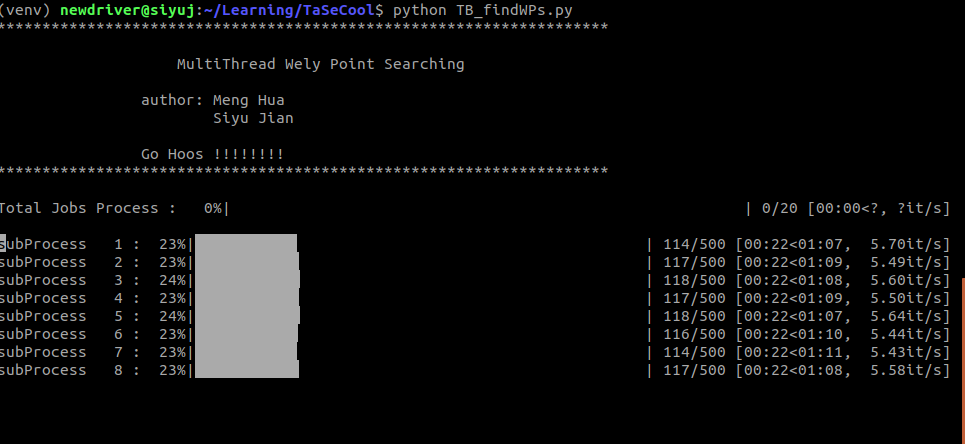

# TaseCool

Package used for calculating the Hamiltonian function and finding the Weyl point.

1. [MultiThread Weyl points Searching](#search-for-the-Weyl-points-in-concurrent-way-tb_findwpspy)

# Usage 
### 1. Search for the Weyl Points in concurrent way TB_findWPs.py

#### set up the configure file 
```json5
{
  "runConfig": {
    "useSysCores": true,  # detect the number of cpus within the code or use the user input number of input 
    "ncore": 10,          # if useSysCores, this would be the number of thread in the concurrent calcultion 
  },
  "kzScan": {             # set up the chop accuracy, currentlt not used 
    "min": 0,
    "nbin":10,
    "max": 10
  },
  "ksScan": {
    "min": 0,
    "nbin":10,
    "max": 10
  },
  "krScan": {
    "min": 0,
    "nbin":10,
    "max": 10
  },
  "gapScan": {
    "min": 0,
    "nbin":10,
    "max": 10
  }
}
```

#### run 
```python
source venv/bin/activate

python TB_findWPs.py
```


#### result 

By default the result will be saved as 
```
Result_%Y_%m_%d_%H_%m_%s.json
```
It is json farmat, the key is the result ID. 


